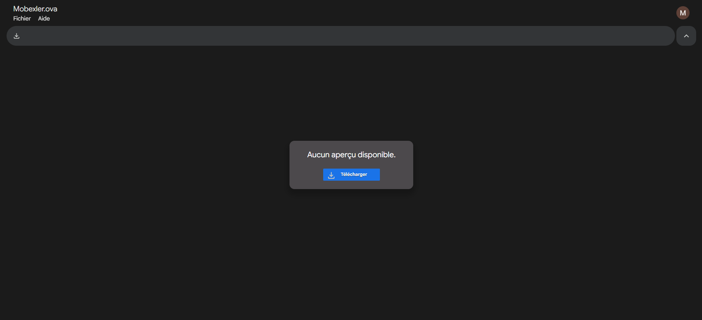
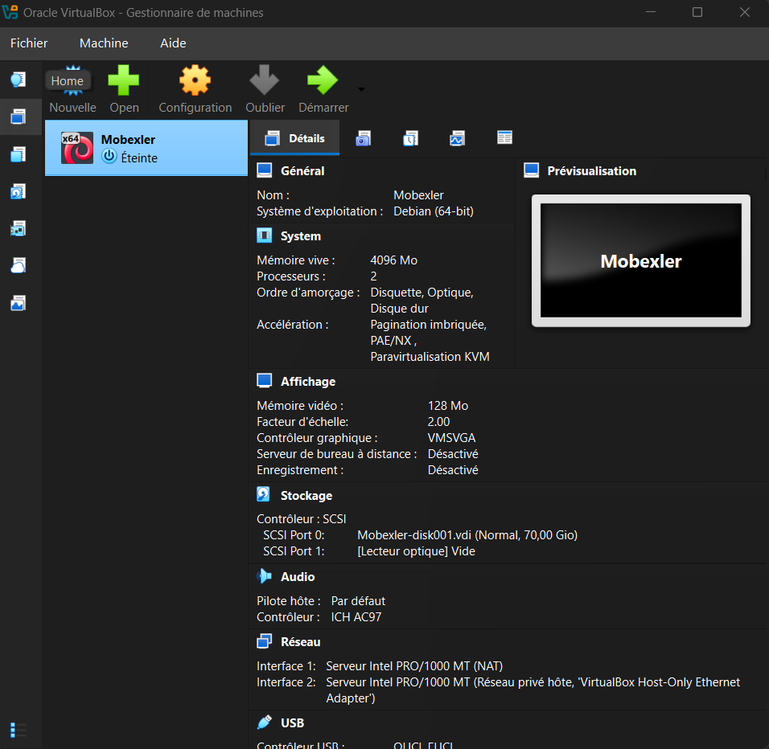
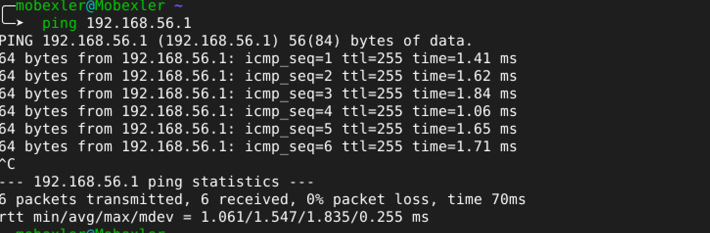
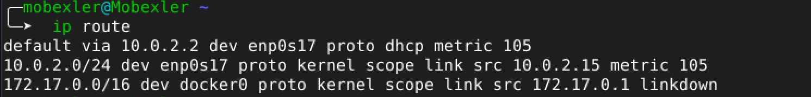
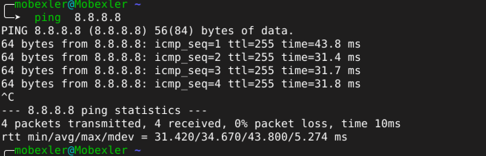
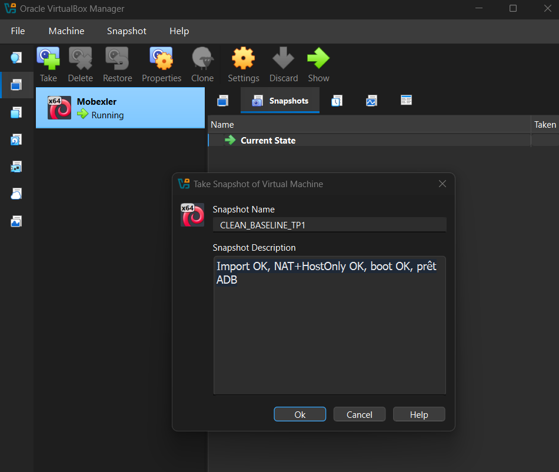
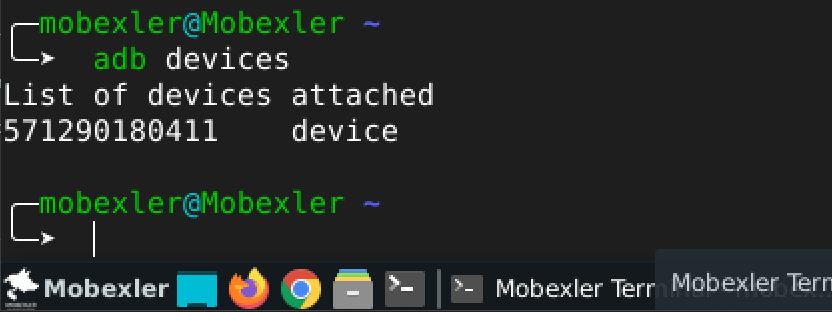

# 1. Importation de la VM
La première étape consiste à télécharger l'image au format .ova. Comme il s'agit d'une image disque complète, aucun aperçu n'est disponible directement dans le navigateur.

Fichier : Mobexler.ova prêt au téléchargement.

# 2. Configuration Matérielle et Réseau
Une fois importée dans VirtualBox, la machine est configurée sur une base Debian (64-bit) avec les spécifications suivantes :

RAM : 4096 Mo

Processeurs : 2

Réseau : Double interface pour permettre à la fois l'accès internet et la communication avec l'hôte (essentiel pour ADB).

Détails de la configuration dans VirtualBox.

# 3. Premier Démarrage et Connexion
Au lancement, le système charge l'interface de connexion personnalisée de Mobexler.

Interface de login Mobexler "For Hackers by Hackers".

# 4. Tests de Connectivité
Il est crucial de vérifier que la machine peut communiquer avec l'extérieur et avec la machine hôte.

Vérification de l'interface Hôte-Privé
Le ping vers 192.168.56.1 confirme que la VM voit bien la passerelle VirtualBox de l'hôte.

Table de routage et DNS
La commande ip route montre que le trafic par défaut passe par l'interface NAT (10.0.2.2).

Test Internet (ICMP & DNS)
Les tests de ping vers l'IP de Google (8.8.8.8) et le nom de domaine (google.com) valident la configuration DNS et l'accès au Web.

# 5. Sauvegarde (Snapshot)
Après avoir validé que tout est fonctionnel (Réseau OK, Boot OK), un snapshot est créé. Cela permet de revenir à un état "propre" après des tests d'applications mobiles ou des manipulations système risquées.

Snapshot : CLEAN_BASELINE_TP1

# 6. Détection de l'appareil de test intrusion (ADB)
La validation finale de l'environnement de laboratoire repose sur la capacité de la VM à communiquer avec le terminal mobile cible via le protocole ADB (Android Debug Bridge). En exécutant la commande adb devices, on confirme que l'appareil de test (ID 571290180411) est correctement attaché et reconnu par Mobexler. Cette étape est cruciale pour permettre l'installation d'outils d'instrumentation comme Frida, l'analyse des journaux système ou l'exécution de charges utiles directement sur le matériel de test lors d'un audit de sécurité.

